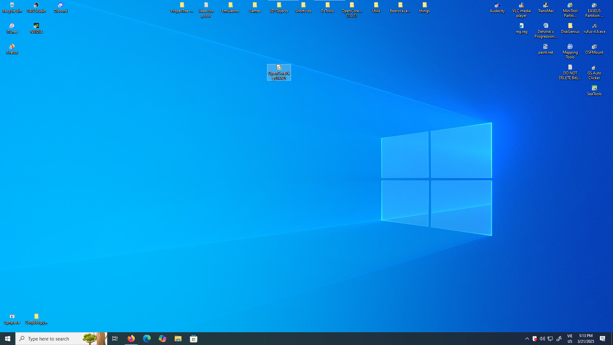
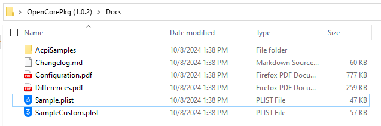
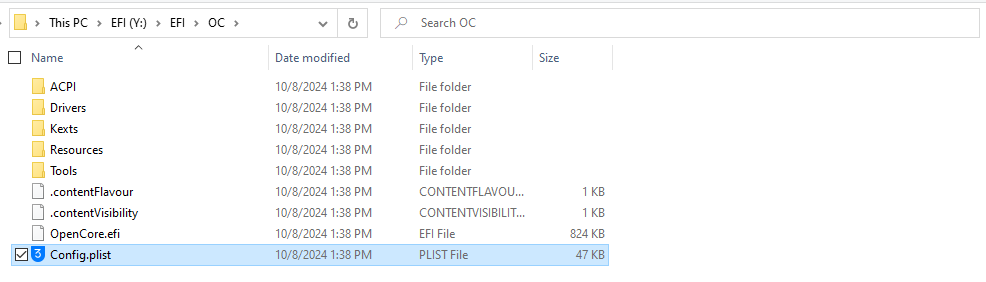
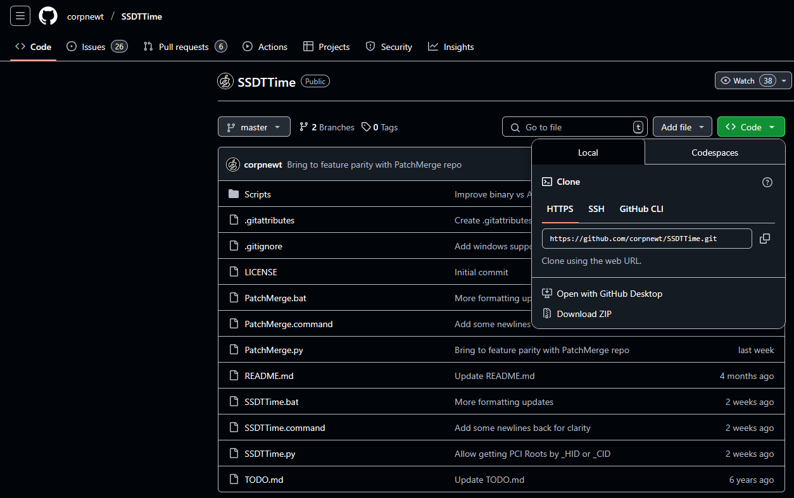
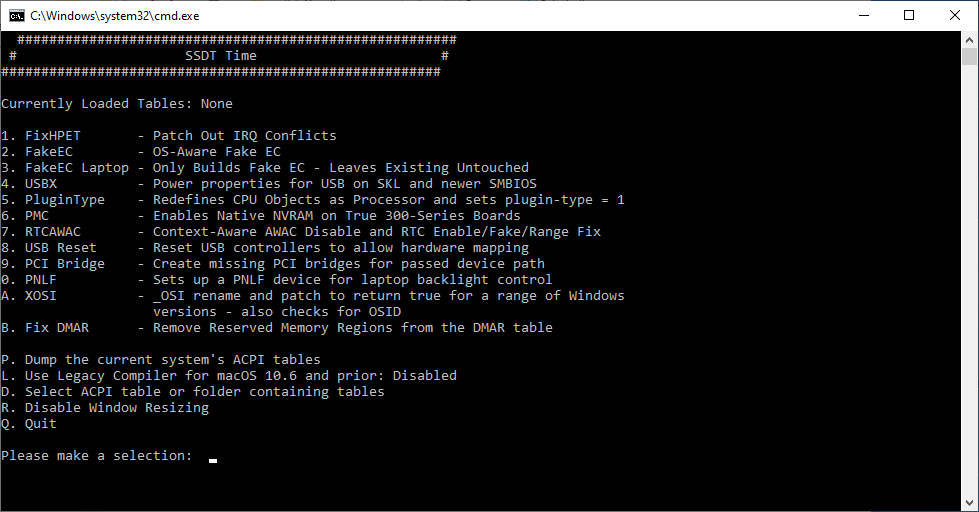

# Gathering files

## OpenCore

### Extraction

After downloading [OpenCorePkg (**pleeeeeeease grab the debug build**)](https://github.com/acidanthera/OpenCorePkg/releases), extract the files to a well-organised place (like a desktop, but not when it's filled with apps):



:::tip Info
A release build (optimized) is a build type where the code is optimised in the compilation process speeding up execution and removing debugging information. In contrast, an unoptimised debug build contains more debugging information and logs, but is significantly slower than an optimised build. Use debug builds only when troubleshooting.
:::

### Preparing the EFI

As you can see in the extracted folder, there are four folders, two of which are named **IA32** and **X64**, the former of which are for 32-bit firmwares, and the latter for 64-bit firmwares. Copy whichever you think your firmware supports to ***the root*** of your USB (Copy the EFI folder inside it, not IA32 or X64).
:::warning Warning
Please use X64 folder for X64 firmwares.
:::

And then, move the `Sample.plist` from (the OpenCorePkg folder)/Docs to your USB -> EFI -> OC:



And then rename it to config.plist:



:::tips Info
OpenCore is not case-sensitive, however you can put some letters in caps as it makes reading easier :P
:::

## ACPI

### Getting SSDTTime

:::tips Fun fact!
In the past, people had to write SSDTs manually, but now there are automated tools! We'll be using CorpNewt's [SSDTTime](https://github.com/corpnewt/SSDTTime)
:::

Because SSDTTime does not have any releases (because it's purely Python), download the source code by clicking on ***Code*** and ***Download ZIP***



### Running SSDTTime

After extracting the ZIP, <span style="color:cyan">**Windows users**</span> should run `SSDTTime.bat`, <span style="color:orange">**Linux users** will have to open terminal inside the extracted ***SSDTTime/SSDTTime-master*** directory and then run 
```sh
python3 SSDTTime.py
```

**macOS users** should run `SSDTTime.command`

After running, it will automatically download iASL (which decompiles ACPI tables). Once done, the script will greet you with this screen:

